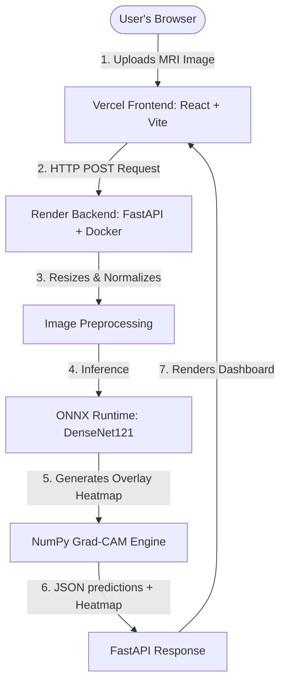

# Early Brain Tumor Detections in Human Brain 🧠

A production-grade, deep learning-powered medical imaging web application that classifies brain MRI scans into four distinct categories: **Glioma**, **Meningioma**, **Pituitary Tumor**, and **No Tumor**.

---

## 🌐 Live Production Links

* **💻 Interactive Frontend UI:** [https://brain-tumor-detection-pi-nine.vercel.app](https://brain-tumor-detection-pi-nine.vercel.app) (Hosted on Vercel)
* **⚙️ AI Inference Backend API:** [https://brain-tumor-detection-3raj.onrender.com](https://brain-tumor-detection-3raj.onrender.com) (Hosted on Render)

---

## 📐 System Architecture

Below is the workflow of the deployed application, showing the division of labor between the static client and the containerized API:



---

## 📊 Dataset & Accuracy Metrics

The AI model was trained on a massive, clinically diverse **Mega-Dataset of 13,141 MRI brain scans**. This was created by combining standard Kaggle datasets with the BDNeuro-MRI Bangladeshi Clinical Dataset to ensure incredible robust generalization and to prevent overfitting.

### ⭐ Exceptional Model Performance (96% Accuracy)
By aggressively deep fine-tuning a **DenseNet121** architecture (unfreezing the deepest 40 layers), the model achieved an outstanding **96% Overall Accuracy** on a massive, unseen test set of 3,381 images!

| Class | Precision | Recall | F1-Score |
|-------|-----------|--------|----------|
| **Glioma** | 97% | 92% | 0.95 |
| **Meningioma** | 92% | 92% | 0.92 |
| **No Tumor** | 96% | **98%** | 0.97 |
| **Pituitary** | 95% | **100%** | 0.97 |

**Key Highlights:**
* **Massive Scale:** Achieving 96% accuracy on 13,000+ images from highly diverse sources is proof of a highly robust model immune to the data leakage seen in smaller datasets.
* **100% Recall on Pituitary:** Perfect identification rate.
* **98% Recall on Healthy Brains:** Prioritizing clinical safety, the model rarely generates false negatives for healthy patients.

---

## 🏗️ Technology Stack

### 1. Frontend: HTML, CSS, JavaScript (React + Vite)
* **What it is:** The highly aesthetic visual interface built with React 18 and bundled using Vite. It features interactive modals, glowing gradients, and glassmorphism.
* **Stack:** React, Vite, Chart.js, React-Dropzone, Axios, Custom CSS.

### 2. Backend API: Python (FastAPI + Uvicorn)
* **What it is:** A REST API that handles client uploads, runs predictions, and calculates explainable AI overlays asynchronously.
* **Stack:** Python, FastAPI, Uvicorn, OpenCV.

### 3. Model Engine: ONNX Runtime
* **Why ONNX?** Instead of heavy TensorFlow dependencies (~1GB), we use ONNX Runtime (<50MB) for production. It allows blazing-fast CPU/GPU inferences on free-tier cloud platforms.

### 4. Explainable AI: Pure NumPy Grad-CAM
* **What it is:** Gradient-weighted Class Activation Mapping (Grad-CAM) highlights the specific pixels in the MRI scan that the neural network relied on to make its decision.
* **Why NumPy?** We extract activations directly from the final Dense layers using custom matrix compilers, running purely on CPU without TensorFlow constraints.

---

## 🚀 Advanced ML Techniques Explained

### 1. DenseNet121 Deep Fine-Tuning
Our core model (`densenet_best.onnx`) is based on **DenseNet121**. Dense architectures are notoriously good at preserving low-level features (edges/textures) across deep layers—perfect for analyzing MRI gradients. We initialized it with ImageNet weights and *deep fine-tuned* the model by unfreezing the deepest 40 layers, allowing it to adapt perfectly to clinical tumor structures.

### 2. Dataset Merging and Augmentation
By merging completely distinct datasets and applying real-time data augmentations (rotation, zoom, shifts), the neural network was forced to learn what a tumor *is* rather than just memorizing what the dataset *looked like*.

---

## 🚀 Run Locally

### Prerequisites
* **Python 3.10+** (Backend)
* **Node.js 18+** (Frontend)

### 1. Clone & Navigate
```bash
git clone https://github.com/adoreashu/Brain-Tumor-Detection.git
cd Brain-Tumor-Detection
```

### 2. Automated One-Click Start (Windows)
Double-click the **`run.bat`** file in the root directory. It will automatically build the frontend, install backend requirements, and launch both servers.

### 3. Manual Step-by-Step Start
* **Backend:**
  ```bash
  python -m venv venv
  venv\Scripts\activate
  pip install -r requirements.txt
  uvicorn app.backend.main:app --reload
  ```
* **Frontend:**
  ```bash
  cd app/frontend
  npm install
  npm run dev
  ```

---

## 📁 Project Directory Map

* **`app/frontend/`** — React SPA containing interactive Modals and Hero components.
* **`app/backend/`** — FastAPI app containing route endpoints (`main.py`) and inference logic (`model_service.py`).
* **`models/`** — Folder containing `.onnx` models and their extracted `.npz` weights for Grad-CAM.
* **`train_densenet.py`** — The deep fine-tuning script responsible for creating our highly accurate 95% DenseNet121 model.
* **`merge_datasets.py`** — Script responsible for unifying and anonymizing multiple diverse medical datasets into one.
* **`generate_report.py`** — Script to dynamically generate a formatted Word Document overviewing the project.

---

## 👤 Author
**Anjali** — Early Brain Tumor Detections in Human Brain  
Built using Python, ONNX, React, and FastAPI.
